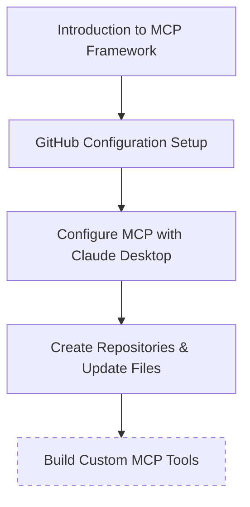

# 🚀 Pre-Workshop Setup Guide: Model Context Protocol Workshop


## 📋 Overview

Welcome to the Model Context Protocol (MCP) workshop! This guide will ensure you have all the necessary tools and accounts ready before our session so you can follow along with the live demonstrations.

> **⚠️ IMPORTANT:** Please complete these setup steps **BEFORE** the workshop begins.

## 🛠️ Required Tools & Accounts

| Tool | Version | Purpose | Required |
|------|---------|---------|----------|
| 🔗 GitHub Account | Latest | Version control & collaboration | ✅ |
| 🤖 Claude Desktop | Latest | AI assistant integration | ✅ |
| 📦 Node.js | 20.0.2 | JavaScript runtime (Firebase) | ✅* |
| 🐍 Python | 3.12+ | Programming language (GCP) | ✅* |

*\*Depending on your development choice (see Section 5)*

## 📝 Detailed Setup Instructions

### 1️⃣ Create a GitHub Account

1. **Visit GitHub's website** - Go to [github.com](https://github.com) in your web browser
2. **Click "Sign up"** - Look for the button at the top-right corner
3. **Enter your email address** - Use an email you have access to
4. **Create a password** - Choose a strong password that meets GitHub's requirements
5. **Choose a username** - Select a unique username for your account
6. **Complete email verification** - Enter the code sent to your email
7. **Answer GitHub's questions** (optional) - About your experience and usage plans
8. **Solve the CAPTCHA puzzle** - Complete the security verification if prompted
9. **Click "Create account"** - After filling in all required fields
10. **Personalize your experience** (optional) - Customize or skip this step
11. **Verify your email address** - Click the verification link sent to your email

### 2️⃣ Install Claude Desktop

1. **Download Claude Desktop** from [https://claude.ai/desktop](https://claude.ai/desktop)
2. **Follow the installation wizard** for your operating system (Windows/Mac)
3. **Sign in with your Anthropic account** (create one if needed)

### 3️⃣ Install a Code Editor (optional)

Any code editor will work for this workshop. Some popular options include:

- ✨ Visual Studio Code
- ✨ Sublime Text
- ✨ Atom
- ✨ Notepad++

No specific extensions are required for this workshop.

### 4️⃣ Choose Your Development Environment

> ⚠️ **Note:** Choose ONE option based on your needs. For Firebase, choose Option A; for GCP, choose Option B. If you plan to do both, set up both options.

#### Option A: Node.js Setup (For Firebase)

1. **Download and install Node.js** from [https://nodejs.org/](https://nodejs.org/)
   - We recommend the LTS version for stability
2. **Verify installation** by opening a terminal/command prompt and typing:
   ```bash
   node --version
   npm --version
   ```

#### Option B: Python Setup (For GCP)

1. **Ensure Python 3.12+** is installed on your system
2. **Verify installation** by opening a terminal/command prompt and typing:
   ```bash
   python --version
   ```
3. **Install uv package manager**:
   - **MacOS/Linux**:
     ```bash
     curl -LsSf https://astral.sh/uv/install.sh | sh
     ```
   - **Windows**:
     ```powershell
     powershell -ExecutionPolicy ByPass -c "iwr https://astral.sh/uv/install.ps1 | iex"
     ```

## 📚 What to Expect During the Workshop



During our workshop, we will:

1. 🔍 Introduce the Model Context Protocol (MCP) framework
2. ⚙️ Set up a GitHub configuration
3. 🔄 Configure MCP to work with Claude Desktop
4. 📁 Create repositories and update files using MCP
5. 🧩 Build custom MCP tools for various client applications (if time permits)

## 📖 Optional References

- [Model Context Protocol Introduction](https://modelcontextprotocol.io/introduction)
- [Smithery AI](https://smithery.ai/)
- [MCP Servers](https://mcpservers.org/)
- [MCP.so](https://mcp.so/servers)

---

## 🤔 Need Help?

If you encounter any issues during setup, please reach out to the workshop organizers before the session begins.

Happy coding! 💻✨
